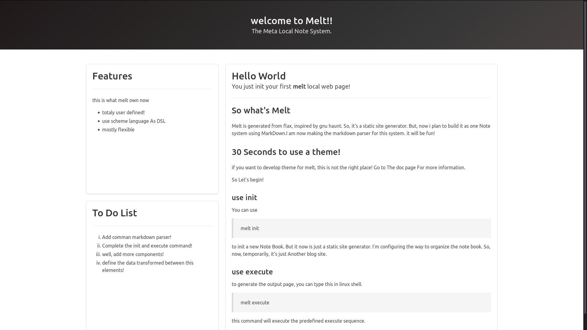

## `Flax` is renamed to `Melt` Now

`Melt` means `Meta Excellent Local Note System`. ( it may be renamed again ... )

Here is a first cli demo. It just has some basic interface now. it doesn't have 
any real function currently.

This is not a formal release though.

## Part Preview
- the init welcome page(use css framework)


## Is there a demo page to view before i download it?

Yes, it is. Now the blog is not working.

You can View my Blog [Here](https://memorytoco.github.io/Lasga/).
It is purely genereted by **melt** along with some css style and maybe some js.
But i'm not quite familiar with front end so it may be ugly.

> Because the melt is undering a big change, i'm unable to update the blog
> now. Having changed to a new temp blog which is generated by Hexo. --> [Lago](https://memorytoco.github.io/Lago/)

## Get started
1. Clone the repository to your machine.
2. use `helper` bash script

```shell
$ ./helper install # use this to install
$ ./helper uninstall # use this to uninstall
```

## current status
* [x] add subcommand logic now
* will add more subcommands to complete the function
  - [x] add init command
  - [x] add exe command
  - [ ] add serve command
* `9%` building `lesh` help system
  - [ ] build a fake shell for the system
* `3%` building markdown parser
* `15%` adding error trackers
* `9%` adding unit test framework for melt

## maybe you are more interested on my temp blog
Here is it . --> [Lago](https://memorytoco.github.io/Lago/) <--

feel free to contact me @ **Memorytoco@gmail.com** ,i will get you around .
